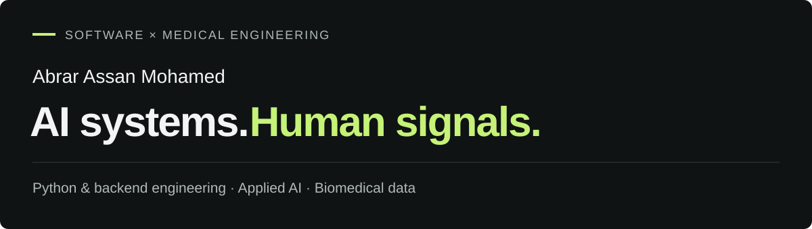

  
    
  <a href="https://abrar0205.github.io/abrar0205/"><strong>Portfolio</strong></a>
  &nbsp; · &nbsp;
  <a href="https://linkedin.com/in/abrar-a-m"><strong>LinkedIn</strong></a>
  &nbsp; · &nbsp;
  <a href="mailto:abraram.cnr@gmail.com"><strong>Email</strong></a>

 

I’m **Abrar**, a Master’s student in **Medical Engineering at FAU Erlangen–Nürnberg**, with experience in Python backend development, AI workflows, and connected-vehicle platforms.

At **Siemens Energy**, I contribute to AI and backend workflows as a working student. Previously, I worked on automotive backend systems at **TATA ELXSI**. My academic projects connect that software background with medical imaging, biosignal processing, and applied machine learning.

**Seeking full-time opportunities in Germany for 2027** in AI, backend engineering, applied ML, and biomedical data.

### What I work on

- **AI workflows & retrieval:** FastAPI services, CrewAI agents, document processing, hybrid retrieval, and validation of LLM outputs.
- **Backend & data systems:** Python APIs, asynchronous processing, messaging, and connected-vehicle data flows.
- **Biomedical computing:** MRI simulation, EMG analysis, and multimodal sensor modelling.

My developing research interests include **EEG, audio, and facial behavior during conversation**.

### Selected work

| Project | What it explores |
| :--- | :--- |
| **[EnterpriseIQ](https://github.com/EnterpriseIQ/enterprise-knowledge-intelligence-platform)** | Document question answering with hybrid retrieval, role-based filtering, citations, and an offline extractive mode. |
| **[Lower-Limb Prosthetic Control](https://github.com/abrar0205/lower-limb-prosthetic-control-ml)** | EMG/IMU sensor fusion and classification with Random Forest and PyTorch MLP baselines. Uses **synthetic data**. |
| **[MRI Simulation Lab](https://github.com/abrar0205/MRI)** | Academic Python work on MRI signal modelling, k-space sampling, and reconstruction using synthetic phantoms. |
| **[Neuromuscular Fatigue Analysis](https://github.com/abrar0205/neuromuscular-fatigue-analysis)** | Group lab analysis of surface EMG and grip-force recordings. RMS, spectral features, and spatial activation maps; raw recordings required to reproduce. |
| **[Energy Market Intelligence](https://github.com/abrar0205/energymarket)** | FastAPI + React dashboard with simulated exchange feeds and a locally modelled event-driven architecture. |
| **[Market Price Visualizer](https://github.com/abrar0205/market-price-visualizer)** | A companion energy-market demo focused on simulated price feeds and interactive charts. |

### Toolkit

**AI & backend** · Python · FastAPI · CrewAI · RAG · ChromaDB · Azure OpenAI · RabbitMQ · Kafka

**ML & signals** · PyTorch · scikit-learn · NumPy · Pandas · SciPy · FFT

**Platforms & interfaces** · AWS · AWS IoT Core · Docker · Git · React · TypeScript

Tools above come from a mix of professional work, academic projects, and independent demos. See the [portfolio](https://abrar0205.github.io/abrar0205/) for context.

---

Professional work is summarized at a high level; employer code and internal materials are not included.

About this repository

This repository contains both my GitHub profile README and my portfolio website, built with React, TypeScript, Vite, and Tailwind CSS.

See [development and deployment notes](./docs/DEVELOPMENT.md) for setup, content editing, and GitHub Pages publishing.

